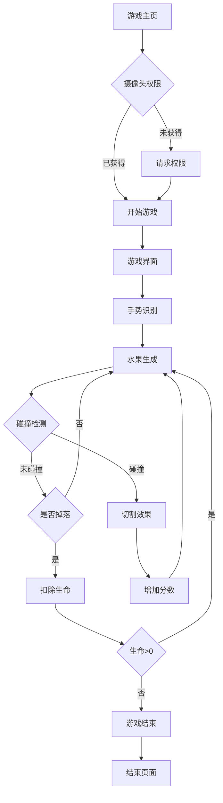
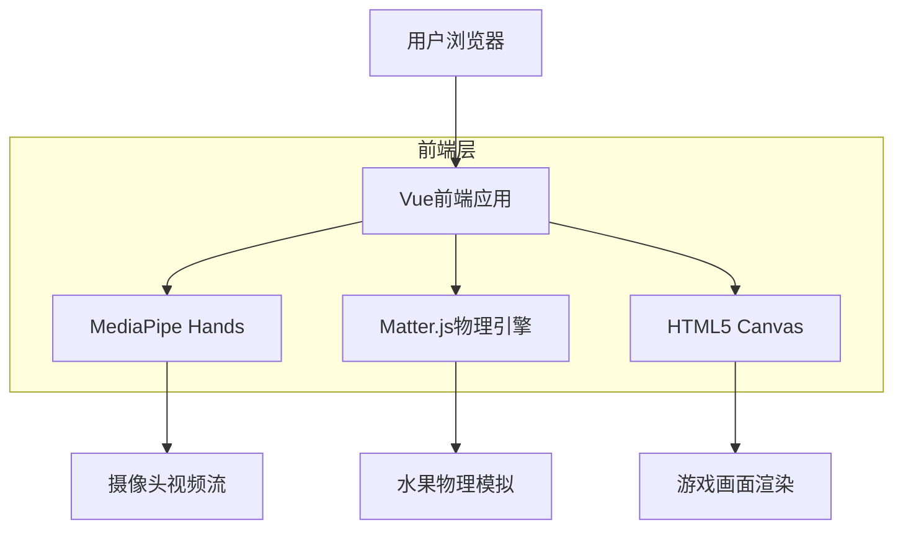

## 1. 产品概述

一款基于Web摄像头的切水果游戏，用户通过手势控制来切割屏幕上飞起的水果。游戏结合实时手势识别技术和物理引擎，提供沉浸式的互动体验。

解决传统切水果游戏缺乏真实感的问题，让用户通过自然的手势动作来体验切水果的乐趣，适合各年龄段用户娱乐放松。

## 2. 核心功能

### 2.1 用户角色

| 角色   | 注册方式 | 核心权限                   |
| ---- | ---- | ---------------------- |
| 游客用户 | 无需注册 | 开始游戏、查看当前分数、查看排行榜      |
| 注册用户 | 邮箱注册 | 保存游戏记录、查看历史最高分、参与排行榜排名 |

### 2.2 功能模块

游戏包含以下主要页面：

1. **游戏主页**：摄像头权限申请、游戏开始按钮、分数显示、设置选项。
2. **游戏界面**：实时摄像头画面、水果投掷动画、手势轨迹显示、分数和生命值。
3. **游戏结束页**：最终得分、重新开始按钮、返回主页、排行榜展示。

### 2.3 页面详情

| 页面名称  | 模块名称    | 功能描述                          |
| ----- | ------- | ----------------------------- |
| 游戏主页  | 摄像头权限模块 | 请求并获取用户摄像头访问权限，显示权限状态提示。      |
| 游戏主页  | 游戏开始模块  | 显示开始游戏按钮，点击后进入游戏界面。           |
| 游戏主页  | 分数展示模块  | 显示历史最高分和当前游客分数。               |
| 游戏界面  | 摄像头画面模块 | 实时显示摄像头画面（镜像效果），作为游戏背景。       |
| 游戏界面  | 手势识别模块  | 使用MediaPipe检测食指位置，实时追踪手指移动轨迹。 |
| 游戏界面  | 水果生成模块  | 定期从屏幕底部生成水果，添加上抛物理效果。         |
| 游戏界面  | 切割检测模块  | 检测手指轨迹与水果碰撞，实现切割效果。           |
| 游戏界面  | 物理引擎模块  | 使用Matter.js模拟重力和水果掉落物理效果。     |
| 游戏界面  | 轨迹绘制模块  | 绘制发光的手指移动轨迹，增强视觉效果。           |
| 游戏界面  | 分数统计模块  | 实时更新切割水果数量，显示当前得分。            |
| 游戏界面  | 生命值模块   | 显示剩余生命值，漏掉水果扣除生命。             |
| 游戏结束页 | 得分展示模块  | 显示本局最终得分和最高连击数。               |
| 游戏结束页 | 重新开始模块  | 提供重新开始游戏按钮。                   |
| 游戏结束页 | 排行榜模块   | 显示全球排行榜或好友排行榜。                |

## 3. 核心流程

用户操作流程：

1. 用户访问游戏主页，系统请求摄像头权限
2. 获得权限后，用户点击开始游戏按钮
3. 进入游戏界面，摄像头画面作为背景显示
4. 水果从屏幕底部向上抛出，用户用手指在摄像头前滑动切割
5. 系统实时检测手指轨迹，与水果碰撞时产生切割效果
6. 切割成功获得分数，漏掉水果扣除生命值
7. 生命值归零时游戏结束，显示最终得分和排行榜



## 4. 用户界面设计

### 4.1 设计风格

* **主色调**：深紫色渐变背景，营造科技感

* **辅助色**：亮黄色和橙色用于水果和特效

* **按钮样式**：圆角矩形，3D悬浮效果

* **字体**：无衬线字体，主要文字24px，次要文字18px

* **布局风格**：全屏游戏界面，顶部显示分数和生命值

* **图标风格**：使用emoji风格的水果图标，简洁可爱

### 4.2 页面设计概述

| 页面名称  | 模块名称  | UI元素                    |
| ----- | ----- | ----------------------- |
| 游戏主页  | 摄像头权限 | 半透明遮罩层，显示摄像头图标和授权按钮。    |
| 游戏主页  | 游戏开始  | 大型圆形开始按钮，带有脉冲动画效果。      |
| 游戏界面  | 摄像头画面 | 全屏实时摄像头画面，镜像显示用户动作。     |
| 游戏界面  | 手势轨迹  | 发光的蓝色轨迹线，跟随手指移动，带有拖尾效果。 |
| 游戏界面  | 水果显示  | 彩色圆形水果，带有高光和阴影效果。       |
| 游戏界面  | 切割特效  | 水果被切割时显示粒子爆炸效果。         |
| 游戏界面  | 分数显示  | 顶部左上角显示当前分数，使用大字体。      |
| 游戏界面  | 生命值   | 顶部右上角显示红心图标表示剩余生命。      |
| 游戏结束页 | 得分展示  | 大字体显示最终得分，带有庆祝动画。       |
| 游戏结束页 | 排行榜   | 卡片式列表显示前10名玩家得分。        |

### 4.3 响应式设计

* **桌面优先**：主要针对桌面端用户优化

* **移动端适配**：支持平板和手机横屏模式

* **触摸优化**：移动设备上支持触摸手势识别

### 4.4 3D效果指导

* **环境**：使用摄像头实时画面作为动态背景

* **光照**：水果添加内发光效果，增强立体感

* **动画**：水果上抛使用缓动动画，切割后分裂成两半

* **粒子效果**：切割时产生彩色粒子爆炸

* **轨迹效果**：手指轨迹使用渐变色和发光效果

***

## 1. 架构设计



## 2. 技术描述

* **前端**：Vue 3 + Vite + TypeScript

* **初始化工具**：vite-init

* **手势识别**：@mediapipe/hands + @mediapipe/camera_utils

* **物理引擎**：matter-js

* **动画效果**：GSAP / Vue Transition

* **状态管理**：Vue Composition API (ref, reactive, computed) + Pinia (可选)

* **后端**：无（纯前端应用）

## 3. 路由定义

| 路由         | 用途                |
| ---------- | ----------------- |
| /          | 游戏主页，摄像头权限申请和开始界面 |
| /game      | 游戏主界面，进行切水果游戏     |
| /game-over | 游戏结束页面，显示得分和排行榜   |

## 4. 核心组件结构

### 4.1 主要组件

```typescript
// 游戏主组件
interface GameProps {
  onGameEnd: (score: number) => void;
}

// 手势识别组件
interface HandTrackingProps {
  onHandMove: (position: {x: number, y: number}) => void;
  // Vue Ref for video element
  videoRef: Ref<HTMLVideoElement | null>;
}

// 水果组件
interface FruitProps {
  id: string;
  position: {x: number, y: number};
  radius: number;
  color: string;
  onSlice: (id: string) => void;
}

// 物理引擎组件
interface PhysicsEngineProps {
  fruits: Fruit[];
  onCollision: (fruitId: string) => void;
}
```

### 4.2 核心API接口

```typescript
// 手势检测数据接口
interface HandLandmark {
  x: number;  // 归一化坐标 (0-1)
  y: number;  // 归一化坐标 (0-1)
  z: number;  // 深度信息
}

// 水果对象接口
interface Fruit {
  id: string;
  type: 'apple' | 'orange' | 'banana' | 'watermelon';
  position: {x: number, y: number};
  velocity: {x: number, y: number};
  radius: number;
  color: string;
  points: number;
}

// 游戏状态接口
interface GameState {
  score: number;
  lives: number;
  combo: number;
  isPlaying: boolean;
  fruits: Fruit[];
  handPosition: {x: number, y: number} | null;
}
```

## 5. 性能优化策略

* **Canvas渲染优化**：使用离屏canvas进行预渲染

* **手势检测节流**：限制检测频率为30fps

* **对象池管理**：复用水果对象，减少垃圾回收

* **碰撞检测优化**：使用空间分割算法减少计算量

* **内存管理**：及时清理不再使用的对象引用

## 6. 浏览器兼容性

* **Chrome/Edge**：完全支持（推荐）

* **Firefox**：支持，但可能需要用户手动授权摄像头

* **Safari**：支持，需要HTTPS环境

* **移动浏览器**：支持，但性能可能受限

## 7. 部署注意事项

* **HTTPS要求**：摄像头API需要安全的上下文环境

* **CORS配置**：确保静态资源正确配置跨域访问

* **性能监控**：添加FPS监控和内存使用监控

* **错误处理**：完善的摄像头权限和API错误处理机制

